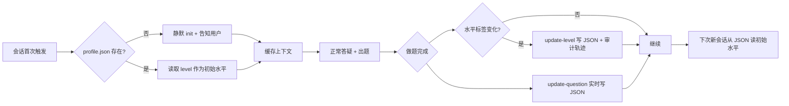
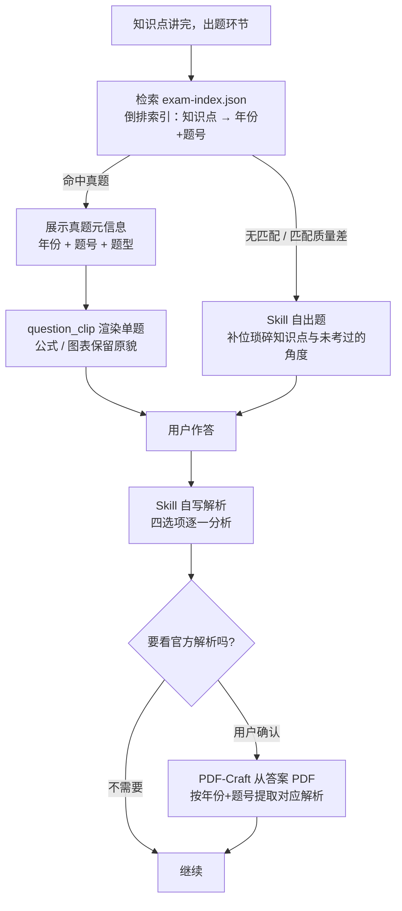
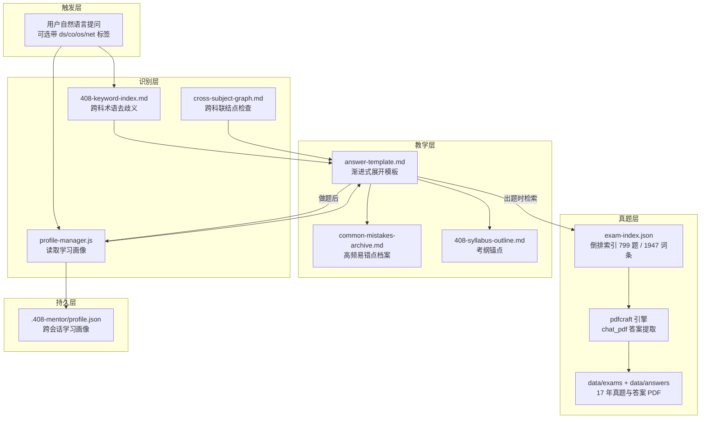

<div align="center">

# 🎓 408-mentor

**一个把 17 年真题装进教案的考研 408 AI 良师 Skill——讲原理、辨易错、出真题、追弱项**

*An AI mentor for China's CS postgraduate entrance exam (408) — adaptive, persistent, cross-subject.*


[](https://nodejs.org/)
[](https://www.python.org/)
[](408-mentor/references/exam-archive/exam-index.json)
[](./408-mentor/references/408-syllabus-outline.md)
[](408-mentor/SKILL.md)
[](./LICENSE)

[快速开始](#-快速开始) · [设计哲学](#-设计哲学良师不是搜索引擎) · [核心机制](#-核心机制) · [项目结构](#-项目结构) · [技术亮点](#-技术亮点)

</div>

---

## 📖 这是什么

考研 408 统考四科——数据结构、计算机组成原理、操作系统、计算机网络——每一科都厚得像砖头，知识点之间还互相勾连（虚拟内存横跨 OS 和计组，Cache 和页面置换同源）。刷题能查漏，但查完缺的那块"为什么"谁来补？

**408-mentor 是一个学习导师 Skill**，当你在对话中提出 408 相关问题时自动触发。它不直接甩答案，而是像一位经验丰富的辅导老师那样：

- 先用一句话让你抓住本质，再分层展开原理
- 每讲完一个点出一道选择题检验——**优先从 17 年真题库里检索**，答错就领你走完纠错闭环
- 记住你的水平和做题轨迹，换一个对话窗口也不忘
- 涉及跨科的知识点，主动提示"这里还牵连着哪一科"

> 💡 它做良师，不做搜题器。它讲的是"为什么这样、怎么考、坑在哪"，而不是"选 C 因为 ABCD"。

---
## 🧭 三大支柱

|                                                                                         📜 真题驱动                                                                                         |                                                                       🎚️ 因材施教                                                                       |                                                                         🔗 跨科联结                                                                         |
| :----------------------------------------------------------------------------------------------------------------------------------------------------------------------------------------: | :----------------------------------------------------------------------------------------------------------------------------------------------------: | :--------------------------------------------------------------------------------------------------------------------------------------------------------: |
| 2009–2025 共 17 年真题+答案 PDF 全量入库，构建 **799 题倒排索引**（年份/题号/题型/科目/知识点/页码/题干原文），按知识点精准检索后**裁剪为单题截图**（避免整页暴露邻题），官方解析按需从答案 PDF 懒提取。 | **三信号分层**判定水平（初学/复习/冲刺），回答结构、易错数量、出题难度随水平自适应；做题记录沉淀为跨会话画像，**弱项自动追踪**并在后续回答中主动提醒。 | 术语索引解决跨科歧义（TLB 到底是 OS 还是计组的？），跨科图谱在讲完主科后给出具体到章节的拓展链接；冲刺模式识别**六大跨科综合题高发联结点**并主动出综合题。 |
---

## 🧭 设计哲学：良师不是搜索引擎

一个真正的良师和一个搜索引擎的区别在于三件事：**记得住学生、调得动教法、看得见全局**。408-mentor 的全部设计都围绕这三点展开。

| 设计支柱 | 搜索引擎的做法 | 408-mentor 的做法 |
|---------|--------------|------------------|
| **记得住你** | 每次从零开始 | 跨会话学习画像：水平标签 + 做题记录持久化到 `.408-mentor/profile.json`，下次打开对话不用重新自我介绍 |
| **调得动教法** | 千人一面 | 三信号分层自适应：自声明设标签、措辞做温和修正、做题表现做即时教学调节（换讲法 + 降深度 + 降题难度） |
| **看得见全局** | 孤立知识点 | 跨科知识图谱：虚拟内存讲到一半，主动提示"这里还牵连计组的 TLB"，由你决定是否追问 |

这三支柱不是口号，每一个都落到了具体的文件和脚本上——见下方[核心机制](#-核心机制)。

---

## ⚙️ 核心机制

### 1. 渐进式展开回答结构

每轮回答不是一次性倒完所有内容，而是按层次展开。核心骨架必出，细节层追问才出——避免信息轰炸，尊重学生的认知节奏。

```
🎯 一句话直觉     ← 生活类比，一句话抓住本质（适配水平）        必出
📚 原理深讲       ← 核心概念/机制/数据结构，按水平调深度         必出
├─ 🔬 细节展开    ← 底层/源码级/硬件级                       追问才出
├─ 💻 代码/图示   ← DS 出 C 代码、CO 出 ASCII 图             追问才出
├─ ⚠️ 易错辨析    ← 真实考试中学生的典型误区                  必出
├─ 📝 考点定位    ← 考纲位置 + 考查频率 + 命题角度             必出
└─ ✍️ 来道题试试  ← 真题优先，四选项逐一解析                   必出
```

模板定义在 `references/answer-template.md`，并附"骨架不是枷锁"声明——形式服务于教学效果。

### 2. 三信号分层自适应

水平判断不是一条腿走路，而是三条信号各司其职：

| 信号 | 作用域 | 用途 | 写入 JSON |
|------|--------|------|-----------|
| ① 用户自声明 | 整体水平标签 | 最高优先级，"第一次接触"→ 初学 | `update-level --reason user_declared` |
| ② 问题措辞推断 | 温和修正标签 | 与当前标签严重不符时上调/下调 | `update-level --reason phrasing_*` |
| ③ 做题表现 | **当前知识点闭环** | 连错 2 题 → 三管齐下（换讲法 + 降深度 + 降题难度） | **不写标签**，仅做局部调节 |

关键洞察：做题表现样本太小，不能用来给用户打"你是初学者"的标签——但足以在**当前这个知识点**的教学闭环内做即时调节。这是真实老师做的事：不会因一道题就重新定义学生，但会因一道错题换个讲法。

### 3. 跨会话学习画像

学习画像通过 `scripts/profile-manager.js` 持久化到当前工作目录的 `.408-mentor/profile.json`：



画像结构（`profile-manager.js` 管理，原子写入避免损坏）：

| 字段 | 用途 |
|------|------|
| `level` | 当前水平（beginner / review / sprint），会话初始值 |
| `levelHistory` | 水平变更审计轨迹，记录每次变更原因 |
| `stats` | 做题统计，按章节聚合正确率 |
| `questionLog` | 做题明细日志 |
| `weakTopics` | **自动维护**——`update-question` 按最近做题表现动态识别薄弱 topic（入列/出列全自动） |

### 4. 跨科知识联动

很多 408 考点是跨科的，强行只讲一科是失职，全跨是灌水。408-mentor 采用**主科详讲 + 关联科拓展链接**策略：

```
[主科视角详细展开]
   ↓
┌─────────────────────────────────────┐
│ 🔗 拓展链接                         │
│ 这也涉及 计算机组成原理              │
│ ❮ 存储系统 - TLB 快表 ❯            │
│ → 想了解 TLB 在硬件层面如何加速？   │
│   可以追问！                        │
└─────────────────────────────────────┘
```

跨科联结点定义在 `references/cross-subject-graph.md`，覆盖 25+ 联结点，含 7 个考研综合题高频跨科套路。

### 5. 纠错四步法 + ⑤ 易错汇总

答错题不是终点，而是教学的起点：

```
① 鼓励      "这个选项很典型，很多同学会选它"
② 指出错因   "选项 B 描述的是分段机制，不是分页机制"
③ 重讲推理   重新梳理正确的推导链条
④ 变式题     同一知识点换角度再出一道
⑤ 易错汇总   关联考试中最常见的 2-3 个踩坑点，提前帮学生避雷
```

### 6. 真题优先出题闭环

出题源不是"随便编一道"，而是**真题优先，无匹配则自出**。17 年真题（2009-2025）已预构建为倒排索引：799 道题、1947 个知识点词条，每条含年份、题号、题型、科目、章节、知识点标签与原文页码。



三条设计取舍：

- **优先近 6 年**（2020-2025）：命题风格更接近当前考试，老题作补位
- **单题裁剪而非整页**：`question_clip.py shot <年> <题号>` 自动读取索引中的 `clip`（每题预计算的裁剪框），渲染为单题 PNG；避免整页截图导致邻题题干/选项剧透。
- **官方解析按需提取**：先让学生看 Skill 自写的教学化解析，想看官方原文时再从答案 PDF 懒提取——不预先灌满上下文

<details>
<summary><b>📄 官方解析提取命令（点击展开）</b></summary>

用户作答并确认想看官方解析后运行（`--text_fallback` 每次都带上——2019/2021/2024/2025 的答案 PDF 是扫描件无文本层，缺参会直接报错；有文本层的年份该参数自动不生效）：

```
python scripts/pdfcraft/pdfcraft.py chat_pdf --input data/answers/<2010-2019|2020-2025>/<年份>-answer.pdf --question "<题干关键词>" --text_fallback references/exam-archive/extracted-text/<年份>-answer.txt
```

选择题答案速查表在答案 PDF 首页，综合题有【答案要点】详解。

</details>

### 7. 索引一次构建，运行时只读

真题索引是**一次性资产**：`exam-pdf-loader.js` 负责确定性部分（PDF 文本提取、按题号分割），知识点标注由 LLM 逐题分析后写入 `exam-index.json`，此后运行时 LLM 只读不建。文本提取刻意绕开 PDF-Craft 的通用 extract_text——自研 `extract_exam_text.py` 用 PyMuPDF 直提以绕过真题 PDF 的 CID 字体编码问题，提取失败自动 fallback OCR。

---

## 🏗️ 架构总览



---

## ✨ 功能全景

- 🎯 **渐进式展开回答** — 🎯直觉 → 📚原理 → ⚠️易错 → 📝考点 → ✍️出题五层必出，细节与代码图示追问时才展开（`references/answer-template.md`）
- 🎚️ **三水平自适应** — 初学（类比+前置知识）/ 复习（完整推理链）/ 冲刺（考点直击+真题变式）三档教学策略
- 📝 **真题出题闭环** — `search` 检索 799 题索引 → `question_clip shot` 单题裁剪截图 → 自写四选项解析 → `chat_pdf` 按需提取官方解析
- 🖼️ **单题裁剪截图** — 命中真题后裁剪为单题 PNG，避免整页暴露邻题，公式图表原貌保留（`question_clip.py`）
- 🔍 **扫描件 OCR 兜底** — 2019/2021/2024/2025 四份扫描版答案 PDF 经 300dpi OCR 入库，检索自动回退（`extract_exam_text.py`）
- 🧠 **跨会话学习画像** — `.408-mentor/profile.json` 记录水平标签与逐题对错，会话重置不丢档案（`profile-manager.js`）
- 📌 **弱项自动追踪** — 滑动窗口规则（近 10 题同一知识点 ≥3 答且正确率 <50%）自动标记弱项，回答开头主动加重辨析
- 🩹 **纠错四步法 + ⑤易错汇总** — 鼓励 → 指错因 → 重讲推理 → 变式题，再汇总该考点 2-3 个真实踩坑点（`common-mistakes-archive.md`）
- 🔗 **跨科拓展与综合题** — 跨科图谱尾部挂"拓展链接"；冲刺模式命中"虚拟内存+Cache+TLB"等联结点时主动推荐跨科大题（`cross-subject-hub.json`）
- 📚 **王道/天勤风格术语** — 术语首现中英全称标注，数据结构一律 C 语言/类 C 伪代码，与 408 真题一致
- 🛠️ **pdfcraft PDF 引擎** — 49 命令纯 Python PDF 工具箱（提取/编辑/转换/OCR/表单/安全），独立 venv 一键初始化

---

## 🚀 快速开始

### 0️⃣ 环境要求

| 组件 | 版本 | 说明 |
|------|------|------|
| Claude Code / Codex / Cursor / OpenClaw / Gemini CLI 等，任选其一 | 任意支持 Skill 的版本 | Skill 运行环境 |
| Node.js | 18+ | `profile-manager.js` / `exam-pdf-loader.js` 依赖 |
| Python | 3.8+ | PDF 处理引擎依赖（仅首次初始化） |

### 1️⃣ 安装

打开你正在用的 agent，直接告诉它：

```
帮我安装这个 skill：https://github.com/WeatherCore/408
```

### 2️⃣ 初始化 PDF 环境（可直接跳过）

真题截图出题与官方解析提取依赖 PDF 处理引擎，首次使用前初始化一次：

```
cd 408-mentor/scripts/pdfcraft
setup.bat
```

> 索引数据（`exam-index.json`）已随仓库提供，开箱即用；只有想从零重建索引和新增真题 PDF 时才需要这一步。

### 3️⃣ 开始使用

直接用自然语言提问，不需要任何命令前缀：

```
讲一下虚拟内存的工作原理
[os] 页面置换算法有哪些？
我第一次接触，完全不懂 Cache 是什么
TCP 和 UDP 的区别
```

首次在某个工作目录使用时，Skill 会自动创建 `.408-mentor/profile.json` 并告知你。

### 4️⃣ 可选：科目标签

Skill 会自动识别问题属于哪个科目。想手动限定视角时，在问题前加标签：

| 标签 | 科目 |
|------|------|
| `[ds]` | 数据结构 |
| `[co]` | 计算机组成原理 |
| `[os]` | 操作系统 |
| `[net]` | 计算机网络 |

### 5️⃣ 水平自适应信号

通过说法让 Skill 知道你的水平：

| 你想表达 | 可以这样说 |
|---------|----------|
| 🟢 零基础 | "第一次接触"、"完全看不懂"、"我是零基础" |
| 🟡 复习中 | "之前学过但忘了"、"帮忙梳理一下" |
| 🔴 冲刺中 | "考点是什么"、"高频命题角度"、"来道难题" |

### 6️⃣ 画像管理

| 操作 | 说法 |
|------|------|
| 重置话题 | "弄明白了"、"谢谢"、"换话题"、"下一个" |
| 清除学习记录 | "重置画像"、"清除我的学习记录" |

<details>
<summary><b>📁 进阶用法：分科档案（点击展开）</b></summary>

408 通常是"学完一门再下一门"。Skill 把画像存到当前工作目录的 `.408-mentor/profile.json`。**为四科各开一个工作目录**，就能天然隔离每科的画像和做题记录：

```
考研复习/
├── 数据结构/      ← 在这里问 DS 问题，画像记录 DS 进度
├── 计组/          ← 在这里问 CO 问题，画像记录 CO 进度
├── 操作系统/      ← 在这里问 OS 问题，画像记录 OS 进度
└── 网络/          ← 在这里问 NET 问题，画像记录 NET 进度
```

每个目录的画像独立：水平标签、做题统计、未来扩展的薄弱点追踪都互不干扰。

**`.gitignore` 提醒：** 如果工作目录是 git 仓库，记得把 `.408-mentor/` 加入 `.gitignore`。

</details>

<details>
<summary><b>🔧 profile-manager.js 命令参考（点击展开）</b></summary>

| 命令 | 用途 |
|------|------|
| `node scripts/profile-manager.js read` | 读取画像（不存在返回 null） |
| `node scripts/profile-manager.js init --subject <ds\|co\|os\|net> --level <beginner\|review\|sprint>` | 初始化空画像 |
| `node scripts/profile-manager.js update-question --chapter <章节> --topic <主题> --correct <true\|false> --difficulty <easy\|medium\|hard>` | 追加做题记录并更新统计 |
| `node scripts/profile-manager.js update-level --level <beginner\|review\|sprint> --reason <user_declared\|phrasing_escalation\|phrasing_downgrade>` | 更新水平标签（写审计轨迹） |
| `node scripts/profile-manager.js reset` | 清空画像（删除文件） |

</details>

<details>
<summary><b>📄 重建真题索引（点击展开）</b></summary>

索引已随仓库提供，通常无需重建。更换/新增真题 PDF 后，按以下流程重建：

| 步骤 | 命令 | 说明 |
|------|------|------|
| 1 | `node scripts/exam-pdf-loader.js extract-all` | 批处理所有年份 PDF 文本提取 |
| 2 | `node scripts/exam-pdf-loader.js split <年份>` | 按题号分割指定年份文本 |
| 3 | LLM 逐题标注知识点 | 标注结果写入 `exam-index.json` |
| 4 | `node scripts/exam-pdf-loader.js backfill --force` | 将 split 产物的 examPage/rawText 回填进索引 |
| 5 | `python scripts/question_clip.py build` | 预计算每题裁剪框存入索引 clip 字段 |
| 查询 | `node scripts/exam-pdf-loader.js search <关键词>` | 搜索索引中的题目 |
| 统计 | `node scripts/exam-pdf-loader.js stats` | 查看题库统计 |

文本提取由 `scripts/extract_exam_text.py` 完成：PyMuPDF 直提绕过真题 PDF 的 CID 字体编码问题，失败自动 fallback OCR（需 pytesseract）。

</details>

---

## 📁 项目结构

```
408/                                   ← 仓库根目录
├── README.md                          ← 本文件
├── Description.md                     ← 中英双版项目名片
├── LICENSE                            ← MIT
│
├── 408-mentor/                        ← Skill 本体
│   ├── SKILL.md                       ← 核心定义（触发规则、工作流、决策树、约束）
│   │
│   ├── references/                    ← 教学知识库 + 真题档案
│   │   ├── 408-syllabus-outline.md    ← 四科完整考纲大纲（162 行）
│   │   ├── 408-keyword-index.md       ← 术语→科目映射表（200+ 术语，聚焦跨科去歧义）
│   │   ├── cross-subject-graph.md     ← 跨科知识联结点图谱（25+ 联结点）
│   │   ├── common-mistakes-archive.md ← 四科高频易错点档案（60+ 易错点）
│   │   ├── answer-template.md         ← 渐进式回答模板 + 水平适配规则
│   │   └── exam-archive/              ← 真题索引档案
│   │   ├── exam-index.json        ← 倒排索引（799 题 / 1947 知识点词条 / 单题裁剪框 clip）
│   │   ├── extracted-text/        ← 17 年真题+答案的提取文本（34 份）
│   │   └── test-images/           ← question_clip 单题裁剪示例图
│   │
│   ├── scripts/                       ← 工具脚本
│   │   ├── profile-manager.js         ← 学习画像 JSON 读写（read/init/update/reset）
│   │   ├── build-keyword-index.js     ← 术语索引构建/覆盖率检查
│   │   ├── exam-pdf-loader.js         ← 真题批量索引构建（extract-all/split/backfill/list/stats/search）
│   │   ├── extract_exam_text.py       ← 真题文本提取（PyMuPDF 直提 + OCR fallback）
│   │   ├── question_clip.py           ← 单题裁剪截图（build 预计算裁剪框 / shot 渲染单题）
│   │   └── pdfcraft/                  ← PDF 处理引擎（从 PDF-Craft 提取）
│   │       ├── pdfcraft.py            ← CLI 入口，49 个命令
│   │       ├── pdfkit/                ← 内置命令包
│   │       └── setup.bat              ← 初始化 Python venv（首次使用前运行）
│   │
│   ├── data/                          ← 真题数据
│   │   ├── exams/                     ← 17 年真题 PDF（2009-2025）
│   │   │   ├── 2010-2019/            ← 2009-2019 真题 PDF
│   │   │   └── 2020-2025/            ← 2020-2025 真题 PDF
│   │   └── answers/                   ← 17 年答案 PDF（2009-2025-answer）
│   │       ├── 2010-2019/            ← 2009-2019 答案 PDF
│   │       └── 2020-2025/            ← 2020-2025 答案 PDF
│   │
│   └── examples/
│       └── example-dialogs.md         ← 7 个完整对话示例（覆盖三水平 × 四科目 + 真题官方解析流程）
```

> 逐文件深度导读见各文件内部注释，核心设计逻辑见 [SKILL.md](408-mentor/SKILL.md)。

---

## 💡 技术亮点

| 亮点 | 机制 | 落点文件 |
|------|------|---------|
| **三信号分层自适应** | 自声明设标签 / 措辞温和修正 / 做题表现局部调节，不做跨知识点水平推断 | `SKILL.md` Decision Tree |
| **跨会话画像持久化** | 原子写入（临时文件 + rename）+ 审计轨迹 + 章节级做题统计 | `scripts/profile-manager.js` |
| **真题倒排索引** | 799 题 / 1947 知识点词条，索引一次构建运行时只读，检索零运行时成本 | `references/exam-archive/exam-index.json` |
| **单题裁剪截图** | `question_clip.py` 按题号定位并裁剪，避免邻题剧透，综合大题亦能完整呈现 | `scripts/question_clip.py` |
| **官方解析懒提取** | 作答后先给自写解析，用户确认才从答案 PDF 提取，不预灌上下文 | `SKILL.md` 真题出题流程 |
| **CID 字体绕过** | PyMuPDF 直提真题文本，绕开通用 extract_text 的 CID 编码问题，失败 fallback OCR | `scripts/extract_exam_text.py` |
| **分科档案隔离** | 工作目录即画像边界，用户开四个目录天然分科，零配置 | `.408-mentor/profile.json` |
| **渐进式展开** | 核心骨架必出 + 细节层追问才出，配"骨架不是枷锁"弹性声明 | `references/answer-template.md` |
| **跨科去歧义索引** | 200+ 术语表，仅在跨科歧义时强制查表，单科术语 LLM 直接判断 | `references/408-keyword-index.md` |
| **纠错四步法 + ⑤** | 鼓励 → 指错 → 重讲 → 变式 → 易错汇总，连错自动三管齐下 | `SKILL.md` + `references/common-mistakes-archive.md` |
| **四科特色教法** | DS→C 代码、CO→ASCII 图、OS→状态机、NET→协议流，一科一风格 | `SKILL.md` 四科专属教学特色表 |

---

## 🧠 教学机制深入

<details>
<summary><b>🎚️ 三信号分层机制</b>（点击展开）</summary>

三条信号作用域不同、优先级明确，避免"一锤定音"式误判：

| 信号           | 作用域                     | 优先级 | 规则                                                                                 |
| -------------- | -------------------------- | ------ | ------------------------------------------------------------------------------------ |
| ① 用户自声明   | 设定/覆盖水平标签          | 最高   | "第一次接触"→beginner；"之前学过忘了"→review；"考前冲刺"→sprint                      |
| ② 问题措辞推断 | 温和修正水平               | 中     | 自报初学但提问专业 → 温和上调（反之亦然）                                            |
| ③ 做题表现     | **即时教学调节，不改标签** | 局部   | 连错同知识点 2 题 → 换讲法 + 降深度 + 降题难度（三管齐下），仅在当前知识点闭环内生效 |

水平标签变更一律通过 `update-level --reason user_declared|phrasing_escalation|phrasing_downgrade` 写入画像，可追溯每次变更原因（`levelHistory`）。

</details>

<details>
<summary><b>📌 弱项判定与画像字段</b>（点击展开）</summary>

- **弱项规则**（`profile-manager.js` 滑动窗口）：最近 10 条同一 topic 记录中，答题数 ≥3 且正确率 <50% → 进入 `weakTopics`；正确率回升自动出列
- **防污染**：`--correct` 非规范值（如 `True`）直接报错拒绝，绝不静默记为答错
- **防丢更新**：并发写入经文件锁串行化（冒烟测试含 5 路并发用例）
- **隐私**：`.408-mentor/` 已在 `.gitignore`，学习数据不会被误提交；说"重置画像"即删除

</details>

<details>
<summary><b>📚 四科专属教学风格</b>（点击展开）</summary>

| 科目           | 教学手段                    | 回答特色                             |
| -------------- | --------------------------- | ------------------------------------ |
| 数据结构       | C 代码段 + 时空复杂度对比   | 分析代码执行过程，对比结构优劣       |
| 计算机组成原理 | ASCII 结构图 + 数据通路推演 | 字符画展示硬件结构，逐步推演信号流动 |
| 操作系统       | 状态机思维 + PV 操作推演    | 状态转换图描述进程，逐步推演同步互斥 |
| 计算机网络     | 分层递进 + 协议流程推演     | 逐层分析，展示协议交互与报文格式     |

</details>

## 🗺️ Roadmap

- [x] 渐进式展开回答结构
- [x] 三信号分层自适应
- [x] 跨会话学习画像（水平标签 + 做题记录持久化）
- [x] 分科档案隔离（工作目录天然分科）
- [x] 跨科知识联动
- [x] 纠错四步法 + ⑤ 易错汇总
- [x] 真题资料就位（17 年真题 + 答案 PDF 已导入 `data/`，PDF-Craft 引擎已集成）
- [x] 真题索引构建（倒排索引已建成：799 题 / 1947 知识点词条，支持按知识点检索真题出题）
- [x] 单题裁剪截图（798/799 题已预计算裁剪框，避免整页暴露邻题）
- [ ] 官方解析按页直达（按题号定位答案页，替代关键词检索）

---

<div align="center">

## 🤝 参与贡献

**Fork → Branch → PR**，欢迎贡献易错点档案、跨科联结点与工具链改进！

📜 本项目基于 [MIT License](./LICENSE) 开源 · 仓库地址：[WeatherCore/408](https://github.com/WeatherCore/408)

如果这个项目帮到了你的 408 备考，欢迎点一个 ⭐ 让更多考研人看到

</div>